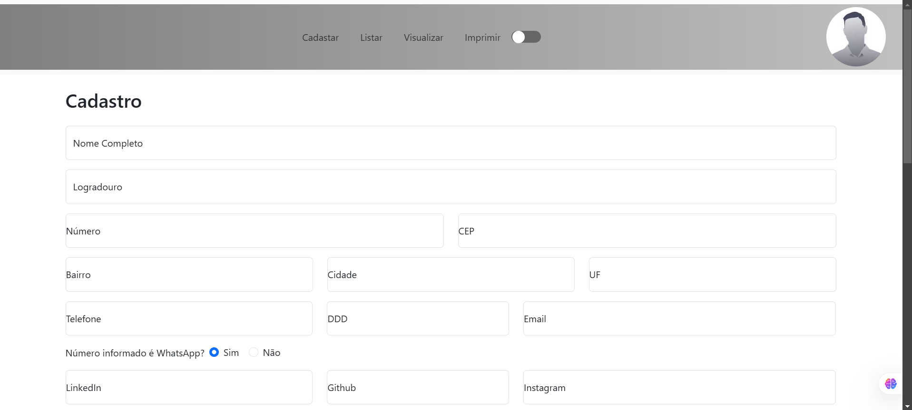

# projetoTreina
Projeto React com API em Spring para criação de um curriculo de forma quue Registre e exiba o curriculo já pronto e pré-formatado.
## Tecnologias Utilizadas
## Front-end  
  
  
  

## Back-end  
  
  
  


## Pré-Requisitos Gerais

- [Baixe o Appache Maven](https://dlcdn.apache.org/maven/maven-3/3.9.9/binaries/apache-maven-3.9.9-bin.zip) e configure as variaveis de ambiente

- [Instale o VScode](https://code.visualstudio.com/)

dentro do Vs code instale as extensões

- Spring Boot Extension Pack 
- Spring Boot Tools 
- Spring Boot Dashboard 
- Spring Initializr Java Support

### Instalação Geral

Escolha um Diretorio para Fazer o clone do Resitório e logo em seguida na barra de pesquisa o diretorio execute cmd e der `enter`, logo pós isso exceute o comando abaixo no cmd já aberto.

```bash
git clone https://github.com/Caio-Marinho/projetoTreina.git
```

## Frontend
</img>

### Pré-Requisitos

#### Instalação
windows
- [Instale o Node.js e o npm](https://nodejs.org/en/download)
<br><br>
Acesse a pasta frontend dentro da barra endereço digite `cmd` e dentro do cmd digite os comando abaixo:

```bash
npm install
```
```bash
npm install react-router-dom react-bootstrap bootstrap html2canvas jspdf
```
logo após excutar por executar o comando abaixo:
```bash
npm run dev
```
e logo depois abra sua navegador e digite:
```bash
http://localhost:5173
```

## SpringApi
### Pré-Requisitos
- [Instale o Java 17](https://www.oracle.com/java/technologies/javase/jdk17-archive-downloads.html)

Agora Acesse a pasta `springapi` pode excutar o comando abaixo no `cmd`:

```bash
mvnw spring-boot:run
```

## Extras

Bibliotecas externas(Java):
- Spring Data JPA
- Spring Web
- Spring Boot DevTools
- MySQL Driver
- Lombok
- OpenFeign

## Autor

@[Caio-Marinho](https://github.com/Caio-Marinho)
